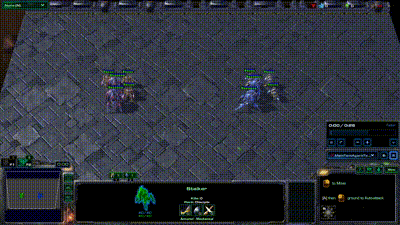
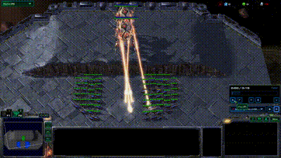
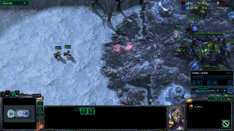
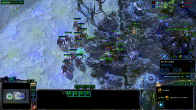
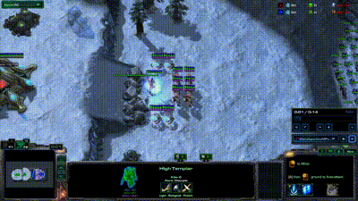
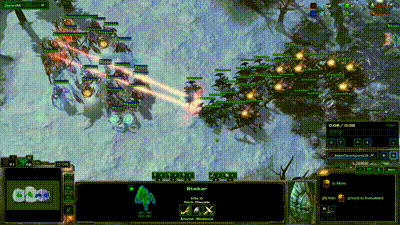

<p align="center">
  
  
  <br/>
  
  
  <br/>
  
  <br/>
  <i>Demos of LLM-Pysc2 with SMAC tasks</i>
</p>


# LLM-PySC2 - LLM StarCraft II Learning Environment

[LLM-PySC2](https://github.com/NKAI-Decision-Team/LLM-PySC2) is 
[NKU Robot Autonomy and Human-AI Collaboration Group](https://rh.nankai.edu.cn/) and 
[NUDT Laboratory for Big Data and Decision](https://www.nudt.edu.cn/)'s Python component of the StarCraft II LLM Decision Environment. 
It wraps [Deepmind](https://deepmind.google/)'s [PySC2 Learning Environment API](https://github.com/deepmind/pysc2) 
in to a LLM energized Multi-Agent Decision Environment. 
This is a collaboration between NKU and NUDT to develop StarCraft II into a rich environment for LLM research. 
LLM-PySC2 provides an interface for LLM agents to interact with StarCraft 2, 
getting textual/multimodal observations and dealing with textual actions.

We also make it possible for LLMs to make decisions in SMAC tasks, which make it possible to compare LLM with RL method.

## Features
1. Support for more than 5 series of mainstream LLMs;
2. Macro decision-making and Micro operation available;
3. Multi-Agent(even heterogeneous agent) collaboration, point-to-point communication, domain communication;
4. Rich experimental tasks, consist of 24 llm_pysc2 experiments with 9 llm_smac tasks (more to be added);
5. Support for parallel experiments, multi-agent multi-thread concurrently query;
6. Diversified observational information, text observation, feature maps and StarCraft2 wiki data;
7. Complete StarCraft2 action space, with support for nearly all kinds of unit skills/abilities;
8. Automatic economic management in complete game;
9. High quality logger and data recorder.


## About

If you use the LLM-PySC2 environment or LLM-SMAC tasks in your research, 
please cite our [github pager](https://github.com/NKAI-Decision-Team/LLM-PySC2) or 
[LLM StarCraft II Pre-Print Paper](https://arxiv.org/abs/2411.05348) after preprint paper published. 
You can also contact us by e-mail [2120230524@mail.nankai.edu.cn]() or [734162621@qq.com]().

Arxiv paper: https://arxiv.org/abs/2411.05348 (Citation: https://ui.adsabs.harvard.edu/abs/2024arXiv241105348L/exportcitation)

## Quick Start Guide

### Get StarCraft II

LLM-PySC2 depends on the full StarCraft II game and only works with versions that
include the API, which is 3.16.1 and above.

#### Linux

Follow Blizzard's [documentation](https://github.com/Blizzard/s2client-proto#downloads) to
get the linux version. By default, LLM-PySC2 expects the game to live in
`~/StarCraftII/`. You can override this path by setting the `SC2PATH`
environment variable or creating your own run_config.

#### Windows/MacOS

Install of the game as normal from [Battle.net](https://battle.net). Even the
[Starter Edition](http://battle.net/sc2/en/legacy-of-the-void/) will work.
If you used the default install location LLM-PySC2 should find the latest binary.
If you changed the install location, you might need to set the `SC2PATH`
environment variable with the correct location.

LLM-PySC2 should work on MacOS and Windows systems running Python 3.8+,
but has only been thoroughly tested on Linux. We welcome suggestions and patches
for better compatibility with other systems.

### Get LLM-PySC2

download the LLM-PySC2 code from our github page [LLM-PySC2](https://github.com/NKAI-Decision-Team/LLM-PySC2).

use pip install to initialize the environment:

```shell
$ conda create --name YOUR_ENV_NAME python==3.9
$ conda activate YOUR_ENV_NAME
$ pip install -e .
```

you can use mirrors like `pip install -e . -i https://mirrors.tuna.tsinghua.edu.cn/pypi/web/simple` to speed up downloading.

### Get the maps

We have placed the required maps in the project folder:

```
llm_pysc2/maps/llm_pysc2
llm_pysc2/maps/llm_smac
```

You need to copy and paste these `2 folders` into the Maps folder of the StarCraft2 program. Generally, the folder path is:

```
C:\Program Files (x86)\StarCraft II\Maps
```

and finally looks like:

```
C:\Program Files (x86)\StarCraft II\Maps\llm_pysc2
C:\Program Files (x86)\StarCraft II\Maps\llm_smac
```

If you used a custom path in installation, you may need to find the Map folder to finish the step.


### Get llm api key

If you do not know how to get api_key, you can contact us to obtain a temporary gpt-3.5-turbo api_key with 2M tokens for free.

You need to write your api_key in `./llm_pysc2/agents/configs/config.ProtossAgentConfig` before test the llm:

    class ProtossAgentConfig(AgentConfig):
        def __init__(self):
            super(ProtossAgentConfig, self).__init__()
            self.race = 'protoss'
            self.model_name = 'gpt-3.5-turbo'
            self.api_base = 'YOUR_API_BASE'
            self.api_key = 'YOUR_API_KEY'
            ...

or set api_key like what we do in `./llm_pysc2/bin/experiment_llm_pysc2.py`:

    config.reset_llm(model_name, api_base, api_key)

if you do not have api_key but still want to test the environment, 
you can set `config.LLM_SIMULATION_TIME = 5` to simulate a 5-second response large model 
and continue the tutorial below.


### Test the environment

After specify your LLM api_key, api_base and model_name, you can run our experiments to test LLM and
both the llm_pysc2 tasks and llm-smac tasks:

```shell
$ python -m llm_pysc2.bin.experiment_llm_pysc2
$ python -m llm_pysc2.bin.experiment_llm_smac
```

These two script will load gpt-3.5 energized agents and use pure text observation to make decisions.
If you want to use multimodal LLMs like gpt-4v, you can set `config.ENABLE_IMAGE_RGB = True` to 
activate image observations.

Also, you can use --parallel parameter (or edit files in ./llm_pysc2/bin) to run several games at the same time:

```shell
$ python -m pysc2.bin.agent --map pvz_task4_level1 --agent_race protoss --parallel 2 --agent llm_pysc2.bin.experiment_llm_pysc2.MainAgentLLMPysc2
$ python -m pysc2.bin.agent --map pvz_task4_level1 --agent_race protoss --parallel 4 --agent llm_pysc2.bin.experiment_llm_pysc2.MainAgentLLMPysc2
```

which may significantly improve experimental efficiency.


## Experiments

We provided two series of experiment tasks: 

    (1) llm_pysc2 experiments: a series of pvz combat, with 8 different settings and 3 levels of difficult for each.
    (2) llm_smac experiments: same as original SMAC tasks, units control by LLM agent instead of RL agent.

You can run these experiments in `./llm_pysc2/bin/llm_pysc2` and `./llm_pysc2/bin/llm_smac`.

### llm_smac experiments

llm_smac experiments are original smac tasks, use the same map and setting of smac tasks. Consider that 
the control of the Zerg and Terran is still ongoing, we will add more smac tasks in the future 
(executable files in `./llm_pysc2/bin/llm_smac`):

    2s3z                3s5z                1c3s5z              
    3s_vs_3z            3s_vs_4z            3s_vs_5z            
    2c_vs_64zg          2s_vs_1sc           3s5z_vs_3s6z        
    (more to be added in future version)

### llm_pysc2 experiments

llm_pysc2 experiments contains 6 pvz combat with 3 level of difficulties, concentrate more attention to larger 
scenarios and the use of unit skills, provide higher complexity and operability:


| Task  | Description                    | Text-Input | Image-Input                | Multi-Agent              | Communication              |
|-------|--------------------------------|------------|----------------------------|--------------------------|----------------------------|
| task1 | 2 Adept harass zerg base       | &#x2714;   | &#x2714; (can be disabled) | &#x2716;                 | &#x2716;                   |
| task2 | 3 Phoenix harass zerg base     | &#x2714;   | &#x2714; (can be disabled) | &#x2716;                 | &#x2716;                   |
| task3 | 6 Stalker intercept airdrops   | &#x2714;   | &#x2714; (can be disabled) | &#x2716;                 | &#x2716;                   |
| task4 | 12 Stalkers vs many zerg units | &#x2714;   | &#x2714; (can be disabled) | &#x2716;                 | &#x2716;                   |
| task5 | 2c3d4s12s vs many zerg units   | &#x2714;   | &#x2714; (can be disabled) | &#x2714; (Isomorphic)    | &#x2716; (can be enabled)  |
| task6 | 1a6h4s12s vs many zerg units   | &#x2714;   | &#x2714; (can be disabled) | &#x2714; (Isomorphic)    | &#x2716; (can be enabled)  |
| task7 | 1m3c3t6v12s vs many zerg units | &#x2714;   | &#x2714; (can be disabled) | &#x2714; (Heterogeneous) | &#x2714; (can be disabled) |
| task8 | 2wp8bg12s multiline attack     | &#x2714;   | &#x2714; (can be disabled) | &#x2714; (Heterogeneous) | &#x2714; (can be disabled) |

Each of them has three different difficulties. Simply, level-1 can be used for demo and method debug; 
level-2 is a standard difficulty, can be used for policy training, and level-3 can be used as an experimental field 
for trained method evaluating, which is quite difficult, and can be served as a good OOD evaluating environment.

More details can be seen in `./docs/llm_pysc2/experiments.md`.


## Customize your Agent/Tasks


### Customize LLM Interaction Process


If you want to redefine a SubAgent's interaction process with the large model, you can redefine the query function of
a SubAgent. View relevant code of `class Customized_LLMAgent(LLMAgent)` in `./llm_pysc2/agents/llm_pysc2_agent.py`:

    class Customized_LLMAgent(LLMAgent)
        def query(self, obs) -> None:

### Customize MainAgent

Main agent is used to interact with pysc2 and does not directly make decisions, so it is not recommended to modify it. 
You can affect the main agent by modifying the config just like what we do in.

```
llm_pysc2/bin/experiment_llm_pysc2.py
llm_pysc2/bin/experiment_llm_smac.py
```

### Customize SubAgents

MainAgent is only an objects used for scheduling cameras, managing internal data and interacting with the env. 
While SubAgents(of the MainAgent) query llm to obtain text actions, plays the role of decision maker.

SubAgent is configured in configurations(llm_pysc2/agents/configs). 
For example, `./llm_pysc2/agents/configs/llm_smac/config_2s3z.py` defines a MainAgent with only one sub agent named
`CombatGroupSmac`:

```
class ConfigSmac_2s3z(ProtossAgentConfig):

  def __init__(self):
    super(ConfigSmac_2s3z, self).__init__()
    ...
    self.AGENTS = {
      'CombatGroupSmac': {
        'describe': "Protoss military commander, controls units to fight against enemy. ",
        'llm': {...},
        'team': [
          {'name': 'Zealot-1', 'unit_type': [units.Protoss.Zealot],
           'game_group': 1, 'select_type': 'group'},
          {'name': 'Zealot-2', 'unit_type': [units.Protoss.Zealot],
           'game_group': 2, 'select_type': 'group'},
          {'name': 'Stalker-1', 'unit_type': [units.Protoss.Stalker],
           'game_group': 4, 'select_type': 'group'},
        ],
        'action': {
            units.Protoss.Zealot: PROTOSS_BASIC_ACTION_SMAC,
            units.Protoss.Stalker: PROTOSS_BASIC_ACTION_SMAC,
        },
      },
    }
    ...
```

you can add more sub agent in your configuration if needed.


### Customize SubAgent's UnitTeams

You can design agent's unit team in config. 
In the example above, we showed a sub agent with 3 teams called 'Zealot-1', 'Zealot-2' and 'Stalker-1'. 
You can redefine your agent teams if needed. 

A team should consist of: 
```
'name': any str
'unit_type': list, of pysc2 unit enum
'game_group': int, -1 to 9, -1 refers to do not add units to any game_group
'select_type': str, 'group' for group recall, 'select' for single select(mouse left click), 'select_all_type' for select screen units of same types(mouse double click)
```

More examples can be viewed in `./llm_pysc2/agents/configs`.

### Customize UnitTeam's action space

You can design team's action space in config. 
In the example(ConfigSmac_2s3z) above, we showed a action space of CombatGroupSmac.
Where `PROTOSS_BASIC_ACTION_SMAC` shape as:

```
[{'name': 'Attack_Unit', 'arg': ['tag'], 'func': [(12, F.Attack_screen, ('queued', 'screen_tag'))]},]
```

and `PROTOSS_BASIC_ACTION_SMAC2` shape as:

```
[{'name': 'Attack_Unit', 'arg': ['tag'], 'func': [(12, F.Attack_screen, ('queued', 'screen_tag'))]},
 {'name': 'Move_Screen', 'arg': ['screen'], 'func': [(331, F.Move_screen, ('queued', 'screen'))]},]
```

Each action should consist of three parts:
```
'name': any str
'arg': list, either of [] / ['tag'] / ['screen'] / ['minimap'] / ['tag', 'screen'] /  ['tag', 'minimap']
'func': a list of triplet (pysc2_func_id, pysc2_func, args_type)
```
More examples can be viewed in `./llm_pysc2/agents/configs` and `./llm_pysc2/lib/llm_actions`.


### Customize Observation Wrapper

You can design your own Observation Wrapper by redefining `o_translator` in `./llm_pysc2/lib/llm_observations.py`.

### Customize Action Recognizer

You can design your own Text Action Recognizer by redefining `a_translator` in `./llm_pysc2/lib/llm_actions.py`.

### Customize LLM Client

You can design your own LLM Client in `llm_pysc2/lib/llm_client` if needed.


## Future Work

We have planed to try our best to add the following features before `2025/2/1`:

    (1) Support of Zerg control
    (2) Support of Terran control
    (3) Compatibility of classic RL algorithms

And more features before `2025/5/1`:

    (1) Full game experiments series1: in map Simple64, Simple96, Simple128
    (2) Full game experiments series2: in map Ancient Cistern LE, Babylon LE, Gresvan LE

Note that this LLM-PySC2 is a preview version, and official version with far more features and better stability
will be open-sourced before `2025/7/1`.


## Contributors

Zongyuan Li (Main Contributor, Nankai University):
Framework design. Multi-Agent structure. Text observation generation. Text action recognition. 
Communication. Experiments design. Prompt. Logger. Documents. Organize.

Runnan Qi, Yanan Ni, Lumin Jiang (National University of Defense Technology):
LLM Client. Multimodal LLM Client. Image observation generation. Documents.

Chang Lu, Xiaojie Xu, Pengfei Li, Yunzheng Guo, Zhe Ma (Nankai University):
Data recorder. Experiments evaluation. Game knowledge.

Kuihua Huang (National University of Defense Technology), Xian Guo, Xuebo Zhang(Nankai University):
Organize.


## Thanks

https://github.com/oxwhirl/smac

https://github.com/google-deepmind/pysc2

https://github.com/histmeisah/Large-Language-Models-play-StarCraftII

