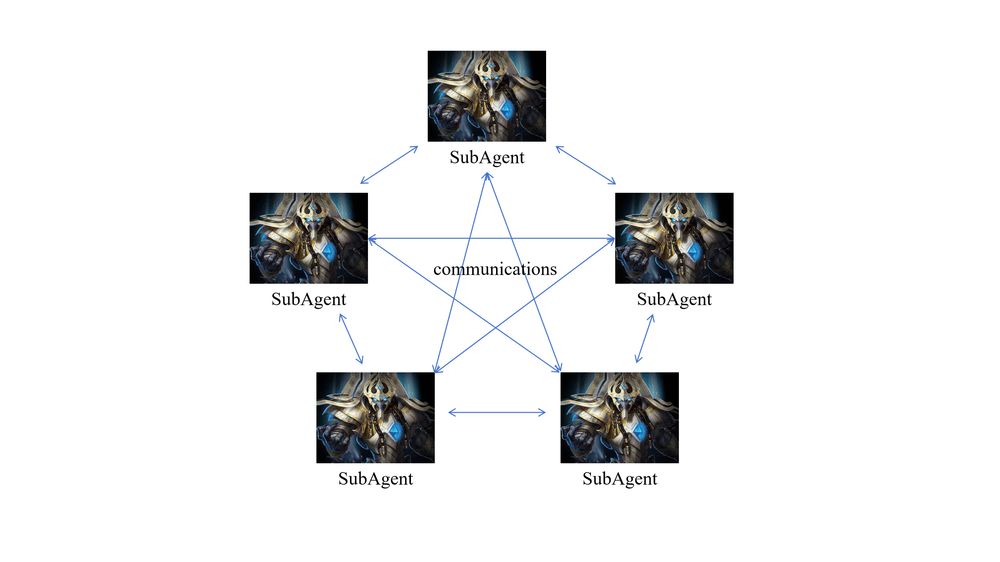
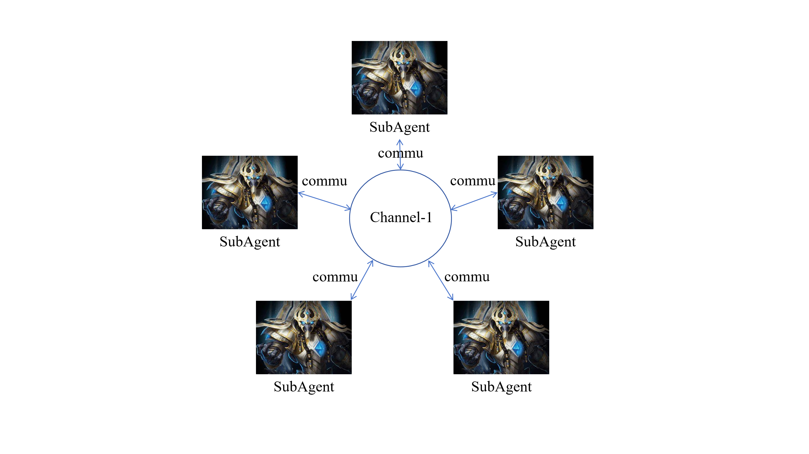

# Communication

Last Edit: 2024/10.

## Overview

Communication is used for Multi-Agent Collaboration and Macro Decision-Making.

We provide 2 kinds of communication: Point-to-Point Communication and Domain Communication.

## Point-to-Point Communication

   
  <i> Fig.1. Point-to-Point communication (These two modes can be used simultaneously)</i> 

To communicate with a specific ally agent, an agent can output as below:

    Communication:
        <MessageTo(AgentName1, '''balabala balabala''')>
        <MessageTo(AgentName2, '''balabala balabala''')>

The environment will automatically detect valid message sending and 
add the message into the agent's observation.

For example, in llm_pysc2 task7, Commander received message in its observation:

    Communication information:
	From Developer: 
		Initiating warp-in of Zealots at key Warp Gates for immediate reinforcement. Ready for next orders.
	From CombatGroup1: 
		Initiating attack on enemy Drones; forces in position to engage.
	From CombatGroup9: 
		WarpPrism teams have initiated phase mode and are moving towards the frontline for unit transport.
	From Developer: 
		Zealots are being warped in to strengthen our frontline forces. Standby for further updates.
	From CombatGroup1: 
		Engaging enemy workers, proceeding with the attack strategy as planned.
	From CombatGroup9: 
		Both WarpPrism teams are en route to the target area for deployment. Ready to engage as needed.

and send messages as below in its response:

    Communications:
        <MessageTo(CombatGroup9, '''Prepare to transport additional Zealots to the frontline as soon as they are warped in. Ensure they are ready for immediate deployment. Prioritize supporting the Stalkers in attacking Drones.''' )>
        <MessageTo(CombatGroup1, '''Focus fire on the nearest Drones. Once engaged, maintain pressure and reposition as needed for maximum effect.''' )>

## Domain Communication

   
  <i> Fig.1. Domain communication (These two modes can be used simultaneously)</i> 

To communicate with a lot of agent in a channel, an agent can output as below:

    Communication:
        <MessageTo(ChannelName1, '''balabala balabala''')>
        <MessageTo(ChannelName2, '''balabala balabala''')>
        <ListenTo(ChannelName1)>
        <ListenTo(ChannelName2)>

The environment will automatically detect valid message sending and 
add the message into the channel. Any agent used <ListenTo(ChannelName1)>
can see all the information in the channel.

Received communication info shape as:

    Communication information:
	From ChannelName1:
        From AgentName1: balabala balabala
        From AgentName2: balabala balabala
        From AgentName3: balabala balabala

If the agent received Point-to-Point message and Domain message at the same time,
received communication info shape as:

    Communication information:
    From AgentNamex: 
        balabala balabala
    From AgentNamey: 
        balabala balabala
	From ChannelName1:
        From AgentName1: balabala balabala
        From AgentName2: balabala balabala
        From AgentName3: balabala balabala