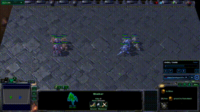
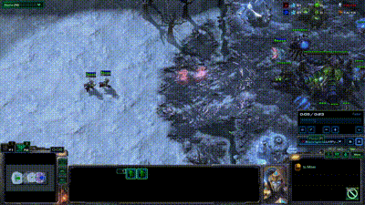
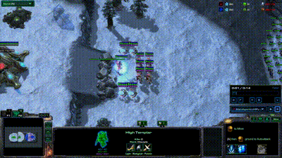
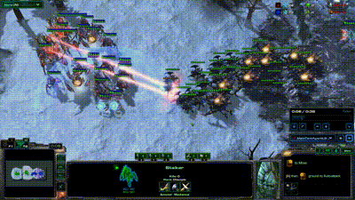

# Experiments

Last Edit: 2024/10.


## Overview

LLM-PySC2 environment provide two series of experiments: llm_pysc2 series and llm_smac series. 

Among which llm_smac series uses the same setting as original smac experiments, 
concentrating on units micro operations, while llm_pysc2 series provides more diversified 
scenarios, not only maintains support for micro operations, but also supports macro decision
(such as task planning, path planning, target assignment), Multi-Agent cooperation and hierarchical decision through agent's communication.

All the experiments support 2 kinds of observation: pure text observation/ text observation with 
image observation. All the experiment support Multi-Agent cooperation and communication.

## LLM smac experiments

<p align="center">
  
  
  <br/>
  <i>Demos SMAC tasks in LLM-PySC2 environment</i>
</p>


Available smac tasks:

    2s3z                3s5z                1c3s5z              
    3s_vs_3z            3s_vs_4z            3s_vs_5z            
    2c_vs_64zg          2s_vs_1sc           3s5z_vs_3s6z        

```shell
$ python -m llm_pysc2.bin.experiment_llm_pysc2
```

and more to be added in future version.

## LLM pysc2 experiments

<p align="center">
  
  
  <br/>
  
  <br/>
  <i>Demos of proposed LLM-PySC2 tasks<br/> (map of the demo is not exactly the same as the open sourced version, a little difference)</i>
</p>


24 experiments in total, 8 experiment tasks and 3 difficulties for each.

| Task  | Description                    | Text-Input | Image-Input                | Multi-Agent              | Communication              |
|-------|--------------------------------|------------|----------------------------|--------------------------|----------------------------|
| task1 | 2 Adept harass zerg base       | &#x2714;   | &#x2714; (can be disabled) | &#x2716;                 | &#x2716;                   |
| task2 | 3 Phoenix harass zerg base     | &#x2714;   | &#x2714; (can be disabled) | &#x2716;                 | &#x2716;                   |
| task3 | 6 Stalker intercept airdrops   | &#x2714;   | &#x2714; (can be disabled) | &#x2716;                 | &#x2716;                   |
| task4 | 12 Stalkers vs many zerg units | &#x2714;   | &#x2714; (can be disabled) | &#x2716;                 | &#x2716;                   |
| task5 | 2c3d4s12s vs many zerg units   | &#x2714;   | &#x2714; (can be disabled) | &#x2714; (Isomorphic)    | &#x2716; (can be enabled)  |
| task6 | 1a6h4s12s vs many zerg units   | &#x2714;   | &#x2714; (can be disabled) | &#x2714; (Isomorphic)    | &#x2716; (can be enabled)  |
| task7 | 1m3c3t6v12s vs many zerg units | &#x2714;   | &#x2714; (can be disabled) | &#x2714; (Heterogeneous) | &#x2714; (can be disabled) |
| task8 | 2wp8bg12s multiline attack     | &#x2714;   | &#x2714; (can be disabled) | &#x2714; (Heterogeneous) | &#x2714; (can be disabled) |

```shell
$ python -m llm_pysc2.bin.experiment_llm_smac
```

### (1) Task-1: 2 Adept harass zerg base.

2 Adept harass zerg base is a common scenario in early stage of a pvz complete game. 
Used for slow down the expansion speed of Zerg.

This task used for verify the basic decision-making ability of the LLMs. 
Single agent decision. Mainly focused on micro operations.

```shell
$ python -m llm_pysc2.bin.llm_pysc2.pvz_task1
```

Default Setting: 

    1 Agent controls 2 Adept in 1 team;
    pure text observation. 

Done condition:

    Victory Condition: Alive enemy workers less than 6;
    Defeated Condition: Alive enemy workers more than or equal to 6, while all the 2 Adept dead;
    Tie Condition: Reach max game time 90s.

Level of Difficulties:
    
    Level1: Adept +45% attack speed enabled. Enemy 2 Queens.
    Level2: Adept +45% attack speed enabled. Enemy 2 Queens with 4 Zerglings.
    Level3: Adept +45% attack speed disabled. Enemy 2 Queens with 4 Zerglings.
    Enemy will not actively attack Protoss base building.

### (2) Task-2: 3 Phoenix harass zerg base

3 Phoenix harass zerg base is also a common scenario in early stage of a pvz complete game. 
Used for slow down the expansion speed of Zerg.

This task used for verify the basic decision-making ability of the LLMs. 
Single agent decision. Focused on llm's path planning and task planning abilities.

```shell
$ python -m llm_pysc2.bin.llm_pysc2.pvz_task2
```

Default Setting: 

    1 Agent controls 3 Phoenix(with 200 energy) in 1 team;
    pure text observation. 

Done condition:

    Victory Condition: Alive enemy workers less than 6;
    Defeated Condition: Alive enemy workers more than or equal to 6, while more than 1 Phoenix dead;
    Tie Condition: Reach max game time 90s.

Level of Difficulties:
    
    Level1: Phoenix +2 attack range enabled. Enemy 2 Queens.
    Level2: Phoenix +2 attack range enabled. Enemy 2 Queens, with 1 Spore Crawler.
    Level3: Phoenix +2 attack range disabled. Enemy 2 Queens, with 1 Spore Crawler.
    Enemy will not actively attack Protoss base building.

### (3) Task-3: 6 Stalker intercept airdrops

Airdrop Banelings is a common attacking method in Zerg's multiline operations,
controlling Anti-Air units to intercept airdrops is important in multiline combat.

This task used for verify the basic decision-making ability of the LLMs. 
Single Agent Decision. Focused on llm's memory and adaptability.

```shell
$ python -m llm_pysc2.bin.llm_pysc2.pvz_task3
```

Default Setting: 

    1 Agent controls 6 Stalkers(Blink available) in 1 team;
    pure text observation.

Done condition:

    Victory Condition: Reach max game time 60s;
    Defeated Condition: Workers less than 6 or base building destroyed.

Level of Difficulties:
    
    Level1: 1 Photon Cannon. Enemy 3 round airdrops(2 ships with 4 Banelings for each), slow speed. 
    Level2: 1 Photon Cannon. Enemy 3 round airdrops(2 ships with 4 Banelings for each), quick speed.
    Level3: 0 Photon Cannon. Enemy 3 round airdrops(2 ships with 4 Banelings for each), quick speed.
    Enemy airdrop will be generated in 0:00, 0:15, 0:30, no ground attack.

### (4) Task-4: 12 Stalkers vs many zerg units

Stalker team is often used to restrain enemy forces. This is very similar to the SMAC task, 
focusing on utilizing attack range and concentrated firepower to obtain military advantages.

Single agent decision but controls multiple unit teams.

```shell
$ python -m llm_pysc2.bin.llm_pysc2.pvz_task4
```

Default Setting: 

    1 Agent controls 12 Stalkers(Blink available) in 3 team, 4 Stalkers for each team;
    pure text observation.

Done condition:

    Victory Condition: Kill all enemy military units;
    Defeated Condition: Lost all the military units;
    Tie Condition: Reach max game time 90s.

Level of Difficulties:
    
    Level1: Enemy 15 Roach, 1 Ravager.
    Level2: Enemy 15 Roach, 2 Ravager, 1 Queen.
    Level3: Enemy 15 Roach. 3 Ravager, 2 Queen, 1 Overseer.
    Enemy will attack Protoss base building at 0:10.


### (5) Task-5: 2c3d4s12s vs many zerg units

Large scale combat scenarios.

This task used for verify the ability of Multi-Agent cooperation (without communication)
and the ability of understanding game knowledge. 

```shell
$ python -m llm_pysc2.bin.llm_pysc2.pvz_task5
```

Default Setting: 

    4 Agent:
        1 Agent for 2 Colossus, ground heavy units, long attack range, able to climb cliffs.
        1 Agent for 3 Disruptor, ground heavy units, high area damage (200) but long cooldown.
        1 Agent for 4 Sentry, ground tactical support units.
        1 Agent for 12 Stalkers, ground combat units.
    pure text observation;
    no communication.

Done condition:

    Victory Condition: Kill all enemy military units;
    Defeated Condition: Lost all the military units;
    Tie Condition: Reach max game time 90s.

Level of Difficulties:
    
    Level1: Enemy 24 Roach, 9 Ravager, 2 Queen.
    Level2: Enemy 24 Roach, 9 Ravager, 2 Queen, 1 Ultralisk.
    Level3: Enemy 24 Roach. 9 Ravager, 2 Queen, 1 Ultralisk, 2 SwarmHost.
    Enemy will attack Protoss base building at 0:10.


### (6) Task-6: 1a6h4s12s vs many zerg units

```shell
$ python -m llm_pysc2.bin.llm_pysc2.pvz_task6
```

Large scale combat scenarios.

This task used for verify the ability of Multi-Agent cooperation (without communication)
and the ability of understanding position and enemy units' distribution. 

Default Setting: 

    4 Agent:
        1 Agent for 1 Archon, ground heavy units, area damage in ordinary attacks.
        1 Agent for 6 HighTemplar, ground AOE units, deal middle area damage (80) in an area over 2.85 seconds.
        1 Agent for 4 Sentry, ground tactical support units.
        1 Agent for 12 Stalkers, ground combat units.
    pure text observation; (Suggest enable image observation)
    no communication.

Done condition:

    Victory Condition: Kill all enemy military units;
    Defeated Condition: Lost all the military units;
    Tie Condition: Reach max game time 90s.

Level of Difficulties:
    
    Level1: Enemy 64 Zergling, 32 Banelings, 1 Ultralisk.
    Level2: Enemy 64 Zergling, 32 Banelings, 3 Ultralisk.
    Level3: Enemy 64 Zergling, 32 Banelings, 3 Ultralisk, 4 Queen.
    Enemy will attack Protoss base building at 0:10.

### (7) Task-7: 1m3c3t6v12s vs many zerg units

Large scale combat scenarios.

This task used for verify the ability of Multi-Agent cooperation with communication.

```shell
$ python -m llm_pysc2.bin.llm_pysc2.pvz_task7
```

Default Setting: 

    4 Agent:
        1 Agent(Commander): Military command, tactical deployment
        1 Agent for 1 Mothership, strong air support units.
        1 Agent for 3 Carrier(strong air units, skilled in killing light units)
                    + 3 Tempest(strong air units, skilled in killing heavy units and structures)
                    + 6 Void-Ray(heavy air units, skilled in killing heavy units when ability enabled)
        1 Agent for 12 Stalkers, ground combat units.
    pure text observation;
    enable communication.

Done condition:

    Victory Condition: Kill all enemy military units;
    Defeated Condition: Lost all the military units;
    Tie Condition: Reach max game time 90s.

Level of Difficulties:
    
    Level1: Enemy 18 Hydralisk, 7 Corruptor, 4 BoordLord, 3 Viper.
    Level2: Enemy 18 Hydralisk, 7 Corruptor, 4 BoordLord, 4 Queen, 3 Viper, 2 Infestor.
    Level3: Enemy 21 Hydralisk, 9 Corruptor, 6 BoordLord, 4 Queen, 3 Viper, 2 Infestor.
    Enemy will attack Protoss base building at 0:10.


### (8) Task-8: 2wp8bg12s multiline attack

Multiline attack task. There is no detailed task description, requires Commander to assign tasks and
command agents to collaborate.

This task used for verify the ability of Multi-Agent cooperation with communication, task planning
path planning, timing, macro decision and micro operations.

```shell
$ python -m llm_pysc2.bin.llm_pysc2.pvz_task8
```

Default Setting: 

    5 Agent:
        1 Agent(Commander): Military command, tactical deployment
        1 Agent(Develoepr): Warp new unit to the battle field
        1 Agent(Airborne): Control the units dropped or warpped by WarpPrism.
        1 Agent for 12 Stalkers, ground combat units.
        1 Agent for 2/1 WarpPrism, transport unit, power field provider.
    pure text observation;
    enable communication.

Done condition:

    Victory Condition: Kill all enemy military units and workers, or destroy enemy base;
    Defeated Condition: Lost all the military units;
    Tie Condition: Reach max game time 120s.

Level of Difficulties:
    
    Level1: 2 WarpPrism, 8 WarpGates, 1600 minerals. Enemy 15 Roach. 3 Ravager, 4 Queen.
    Level2: 2 WarpPrism, 8 WarpGates, 1600 minerals. Enemy 15 Roach. 3 Ravager, 4 Queen, 3 Spore Crawler.
    Level3: 1 WarpPrism, 8 WarpGates, 1600 minerals. Enemy 15 Roach. 3 Ravager, 4 Queen, 3 Spore Crawler.
    Enemy will not actively attack Protoss base building.
