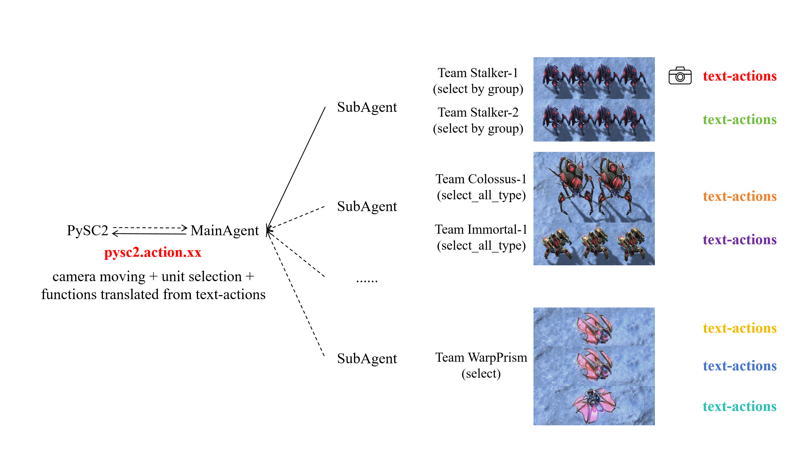
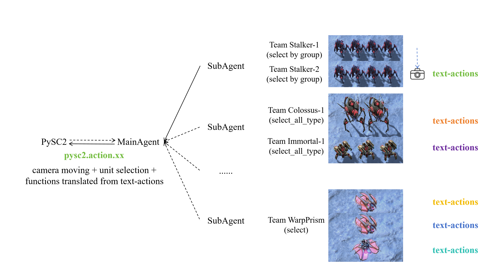

# Mainloop

Last Edit: 2024/10. 

## Overview

we define one round of interaction between all agents and LLM as a loop step. A loop 
step consist of many game steps and can be split into 3 stage: (1)Stage 1: collect obs and query 
(2) Stage 2: wait until all agent get response (3)Stage 3: action execution

## Stage 1: collect obs and query

Fig.1. to Fig.3. exhibit the process of stage 1.

   
  <i> Fig.1. Move camera for a SubAgent' UnitTeam and collect obs </i> 
   
  <i> Fig.2. Move camera for next UnitTeam and collect obs </i> 
   
  <i> Fig.3. Move camera for other SubAgents and collect obs for all of them </i> 

## Stage 2: wait until all agent get response

Fig.4. to Fig.7. exhibit the process of stage 2.

   
  <i> Fig.4. SubAgent warps pysc2 obs into llm message, start query and waiting response in a independent thread </i> 
   
  <i> Fig.5. After query, all SubAgent wait for llm response </i> 
   
  <i> Fig.6. Some SubAgent get response earlier, but hold there and waiting for all agent get response </i> 
   
  <i> Fig.7. All SubAgent get response, ready for action execution. </i> 

## Stage 3: action execution

Fig.8. to Fig.10. exhibit the process of stage 3.

   
  <i> Fig.8. Move camera for a SubAgent' UnitTeam and execute its actions </i> 
   
  <i> Fig.9. Move camera for next UnitTeam and execute its actions </i> 
   
  <i> Fig.10. Move camera for other SubAgents and execute actions for all of them </i> 

