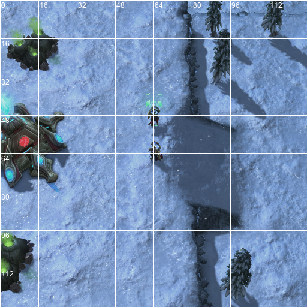
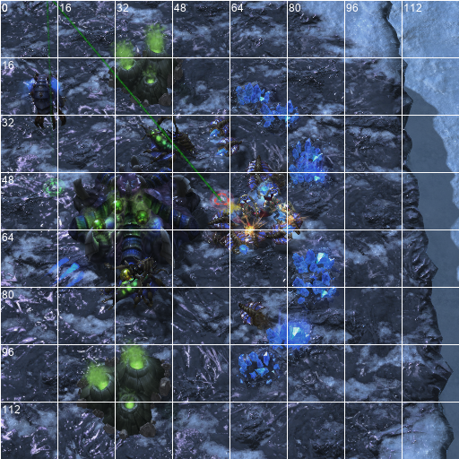
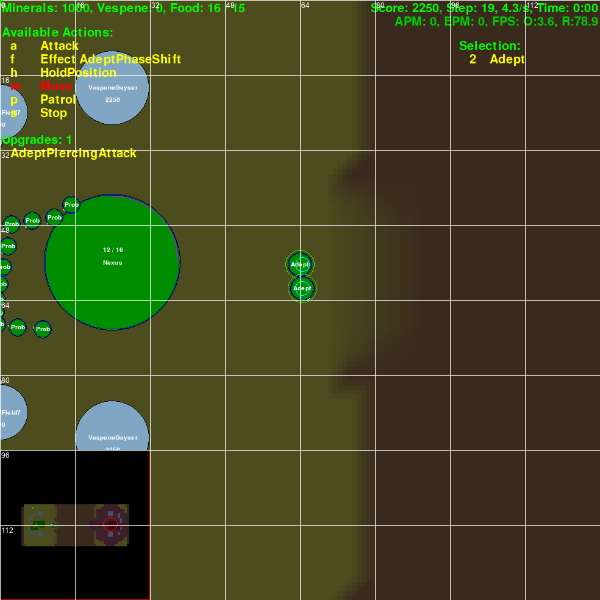

# Observation

Last Edit: 2024/10.

## Overview

Currently, we provide 2 kinds of observation: (1) Text-Observation (2) Image-Observation 
, in the future, we will add (3) Video-Observation into our environment.

You can design your text observation wrapper in `./llm_pysc2/lib/llm_observation.py` to 
obtain customized text observation.

You can design your image observation wrap function in `./llm_pysc2/lib/llm_observation.py` to 
obtain customized image observation.

  
  
  
   
  
  
  
   
  <i> Fig.1. RGB observation and Feature observation</i> 

## Text-Observation

To get text-observation, we predefined 3 obs wrapper, 1 for frontline combat agents, 
1 for supreme military commander, and 1 for agents responsible for development and construction.

### (1) Text-Obs-Wrapper for CombatGroup 

Here is a text-observation of llm_pysc2 experiments task4 level1, it consist of
the following part: Game Info, Unit Team Info, Game Knowledge, Valid Actions, 

Game Info Part: only game time, ignore other global game data like minerals and supply

    Game Info:
    Time: 0:23

Unit Team Part: Nearby unit information, such as Tag, Pos, Health(percentage) etc.

    Team Stalker-1 Info:
        Team minimap position: [37, 33]
        Controled Team Units:
            Unit: Stalker    Tag: 0x100000001    ScreenPos: [52, 38]    Health: 160(100 %)    Weapon_cooldown: 0
            Unit: Stalker    Tag: 0x100680001    ScreenPos: [53, 45]    Health: 84(52 %)    Weapon_cooldown: 0
        Nearby Ally Units:
            Unit: Stalker    Tag: 0x100480001    ScreenPos: [64, 63]    Health: 80(50 %)
            Unit: Stalker    Tag: 0x100540001    ScreenPos: [54, 24]    Health: 160(100 %)
            Unit: Stalker    Tag: 0x100140001    ScreenPos: [57, 19]    Health: 20(12 %)
        Nearby Enemy Units:
            Unit: Overlord    Tag: 0x101ac0001    ScreenPos: [40, 39]    Distance: 2    Health: 200(100 %)
            Unit: Roach    Tag: 0x1008c0001    ScreenPos: [82, 56]    Distance: 6    Health: 64(44 %)
            Unit: Roach    Tag: 0x1006c0001    ScreenPos: [81, 45]    Distance: 5    Health: 97(66 %)
            Unit: Roach    Tag: 0x1009c0001    ScreenPos: [81, 35]    Distance: 5    Health: 77(53 %)
            Unit: Roach    Tag: 0x100a00001    ScreenPos: [82, 51]    Distance: 6    Health: 145(100 %)
            Unit: Roach    Tag: 0x100a40001    ScreenPos: [87, 57]    Distance: 7    Health: 145(100 %)
            Unit: Roach    Tag: 0x100800001    ScreenPos: [86, 47]    Distance: 6    Health: 145(100 %)
    
    Team Stalker-3 Info:
        Team minimap position: [37, 33]
        Controled Team Units:
            Unit: Stalker    Tag: 0x100140001    ScreenPos: [57, 19]    Health: 20(12 %)    Weapon_cooldown: 20
            Unit: Stalker    Tag: 0x100480001    ScreenPos: [64, 63]    Health: 80(50 %)    Weapon_cooldown: 9
            Unit: Stalker    Tag: 0x100540001    ScreenPos: [54, 24]    Health: 160(100 %)    Weapon_cooldown: 21
        Nearby Ally Units:
            Unit: Stalker    Tag: 0x100000001    ScreenPos: [52, 39]    Health: 160(100 %)
            Unit: Stalker    Tag: 0x100680001    ScreenPos: [53, 46]    Health: 85(53 %)
        Nearby Enemy Units:
            Unit: Overlord    Tag: 0x101ac0001    ScreenPos: [39, 39]    Distance: 3    Health: 200(100 %)
            Unit: Roach    Tag: 0x100800001    ScreenPos: [86, 47]    Distance: 6    Health: 145(100 %)
            Unit: Roach    Tag: 0x100a40001    ScreenPos: [87, 57]    Distance: 7    Health: 145(100 %)
            Unit: Roach    Tag: 0x1008c0001    ScreenPos: [82, 56]    Distance: 6    Health: 64(44 %)
            Unit: Roach    Tag: 0x1006c0001    ScreenPos: [81, 45]    Distance: 4    Health: 97(66 %)
            Unit: Roach    Tag: 0x1009c0001    ScreenPos: [81, 35]    Distance: 4    Health: 43(29 %)
            Unit: Roach    Tag: 0x100a00001    ScreenPos: [82, 51]    Distance: 5    Health: 145(100 %)

Game Knowledge Part: Search knowledge of nearby detected unit

    Relevant Knowledge:
        Protoss.Stalker
            A dragoon-like Nerazim unit, able to blink (short-range teleport) and deliver ranged attacks against air and ground units.
            Unit properties: ['ground', 'armored', 'mechanical']
            Weapon info: Attack Range 6, target: ['ground', 'air'], anti: ['armored'], DPS(damage per second) 6, DPS-anti 9
            unit abilities:
                Blink: Available after Blink upgrade in Twilight Council. Stalkers instantly teleport over short distances, Commonly used to pursue the enemy when in an advantageous position or to stay away from the enemy when in a disadvantageous position, or for individual retreat.Range: 8, Cooldown: 7 seconds.
        Zerg.Roach
            Exceptionally tough short ranged unit able to quickly regenerate and move while burrowed.
            Unit properties: ['ground', 'armored', 'biological']
            Weapon info: Attack Range 4, target: ['ground'], DPS(damage per second) 11
        Zerg.Hatchery
            Spawns larvae to be morphed into other zerg strains, generates creep and digests minerals and gas into a usable form. The queen is spawned directly from the hatchery.
            Unit properties: ['ground', 'armored', 'biological', 'structure']

Valid Action part: Search actions from config, show the valid actions(all pysc2 functions of the action is valid).

    Valid Actions:
        Team Stalker-1 Valid Actions:
            <Stop()>
            <No_Operation()>
            <Hold_Position()>
            <Move_Minimap(minimap)>
            <Move_Screen(screen)>
            <Attack_Unit(tag)>
            <Ability_Blink_Screen(screen)>
            <Select_Unit_Blink_Screen(tag, screen)>
        Team Stalker-3 Valid Actions:
            <Stop()>
            <No_Operation()>
            <Hold_Position()>
            <Move_Minimap(minimap)>
            <Move_Screen(screen)>
            <Attack_Unit(tag)>
            <Ability_Blink_Screen(screen)>
            <Select_Unit_Blink_Screen(tag, screen)>
    
    Action Args: 
        (1) tag: tag refers to a hexadecimal number, shape as 0x000000000.
        (2) screen: screen refers to a screen coordinate, shape as [x, y], where x and y range from 0 to 128.
        (3) minimap: minimap refers to a minimap coordinate, shape as [x, y], where x and y range from 0 to 64.
    For example, when you want to use an action like <Action_Name(tag, screen)>, you should output like <Action_Name(0x100580001, [37, 55])>; when you want to use an action like <Action_Name(screen)>, you should output like <Action_Name([66, 78])>. What's more, You need to see clearly whether an action is using screen coordinates or minimap coordinates, If an action name as XXXX_Screen, it uses screen coordinate; if an action name as XXXX_Minimap, it uses minimap coordinate.

Short-term Memory: last action, without analysis and communication.

    Last Step 
    Actions:
        Team Stalker-1:
            <Move_Minimap([36, 32])>
        Team Stalker-3:
            <Attack_Unit(0x1009c0001)>
            <Move_Minimap([36, 32])>
    You need to confirm whether the previous action finished executing, and based on this, determine whether to continue the old strategy or immediately take other actions.

(If you enabled communication, Communication Info will be placed here.)

Experiment Task Description:

    Tasks:
        Team Stalker-1' task: Go to minimap coordinate [36, 32].
        Team Stalker-3' task: Go to minimap coordinate [36, 32].

Final part:

    Give each team no more than 3 actions, among which activity release should usually before move and attack.
    Now, start generating your analysis and actions:

### (2) Text-Obs-Wrapper for Commander

Here is a text-observation of the agent Commander of llm_pysc2 experiments task8 level1,
consider that Commander need to make general military deployment, we send global agent info
to it:

    Game Info:
        Time: 0:07
        Minerals: 1640
        Vespene: 0
        Supply Total: 71
        Supply Left: 31
        Supply Used: 40
    
    Global agent info:
        Agent CombatGroup1:
            Team Stalker-1: Protoss.Stalker x4, minimap position [25, 33]
            Team Stalker-2: Protoss.Stalker x4, minimap position [25, 33]
            Team Stalker-3: Protoss.Stalker x4, minimap position [25, 29]
        Agent CombatGroup9:
            Team WarpPrism-0: Protoss.WarpPrism x1, minimap position [21, 32]
            Team WarpPrism-1: Protoss.WarpPrism x1, minimap position [21, 32]
    
    Relevant Knowledge:
        Protoss.Stalker
            A dragoon-like Nerazim unit, able to blink (short-range teleport) and deliver ranged attacks against air and ground units.
            Unit properties: ['ground', 'armored', 'mechanical']
            Weapon info: Attack Range 6, target: ['ground', 'air'], anti: ['armored'], DPS(damage per second) 6, DPS-anti 9
            unit abilities:
                Blink: Available after Blink upgrade in Twilight Council. Stalkers instantly teleport over short distances, Commonly used to pursue the enemy when in an advantageous position or to stay away from the enemy when in a disadvantageous position, or for individual retreat.Range: 8, Cooldown: 7 seconds.
        Protoss.WarpPrism
            Formerly known as the phase prism, the warp prism is a dual-purpose unit, able to transport units or to create a warp matrix field like the pylon.Warp Conduit:Passive ability. Increases the speed of warp in for units warped into the power field to 4 seconds 
            Unit properties: ['air', 'armored', 'mechanical', 'psionic']
            unit abilities:
                Phase Mode/Transport Mode: Always available. The warp prism can transform to project a power field, allowing the warping in of units and powering Protoss structures. In Phase Mode, the warp prism is immobile. Cost: 0.75 seconds for both transformations.
    
    Tasks:
        Agent task: Organize a multiline combat to defeat enemy.
    
    Communication information:
        From Developer: 
            Initiating warp-in of Zealots at key Warp Gates for immediate reinforcement. Ready for next orders.
        From CombatGroup1: 
            Initiating attack on enemy Drones; forces in position to engage.
        From CombatGroup9: 
            WarpPrism teams have initiated phase mode and are moving towards the frontline for unit transport.
        From Developer: 
            Zealots are being warped in to strengthen our frontline forces. Standby for further updates.
        From CombatGroup1: 
            Engaging enemy workers, proceeding with the attack strategy as planned.
        From CombatGroup9: 
            Both WarpPrism teams are en route to the target area for deployment. Ready to engage as needed.
    
    Available Communication Tragets:
        Developer: Protoss logistics commander. Responsible for unit trainning, unit warp trainning, technology upgrade and order the Builder to build.
        CombatGroup1: Protoss frontline commander, controls several Stalkers. Responsible for providing cover for the main force and restraining enemy forces.
        CombatGroup9: Protoss airborne commander, controls WarpPrism and airborne units like Zealots, Stalkers.Responsible for supplement troops on the front line, or executing multi line combat.
    Available Communication Functions:
        <MessageTo(AgentName, message)>
        <MessageTo(ChannelName, message)>
        <ListenTo(ChannelName)>
    Args explanation:
        (1)AgentName: refers to a name mentioned in Available Communication Tragets.
        (2)ChannelName: shape as Channel-i, i refers to an integer.
        (2)message: any text wrapped between ''' and '''.
    
    Now, start anailysis, making macro decsions in military deployments by sending message to other agents:

### (3) Text-Obs-Wrapper for Developer

Here is a text-observation of the agent Commander of llm_pysc2 experiments task8 level1,
consider that Developer need to make warp train units in task8, we send the info of
Available WarpTrain Field Provider to it:

    Game Info:
        Time: 0:07
        Minerals: 1640
        Vespene: 0
        Supply Total: 71
        Supply Left: 31
        Supply Used: 40
    
    Team WarpGate-1 Info:
        Team minimap position: [13, 25]
        Controled Team Units:
            Unit: WarpGate    Tag: 0x100640001    ScreenPos: [66, 56]    Health: 1000(100 %)    Weapon_cooldown: 0
            Unit: WarpGate    Tag: 0x100e80001    ScreenPos: [34, 120]    Health: 1000(100 %)    Weapon_cooldown: 0
            Unit: WarpGate    Tag: 0x100700001    ScreenPos: [45, 66]    Health: 1000(100 %)    Weapon_cooldown: 0
            Unit: WarpGate    Tag: 0x100380001    ScreenPos: [98, 56]    Health: 1000(100 %)    Weapon_cooldown: 0
            Unit: WarpGate    Tag: 0x100740001    ScreenPos: [34, 88]    Health: 1000(100 %)    Weapon_cooldown: 0
        Nearby Ally Units:
            Unit: Nexus    Tag: 0x101940001    ScreenPos: [82, 104]    Health: 2000(100 %)    Energy: 56
            Unit: Pylon    Tag: 0x1004c0001    ScreenPos: [32, 69]    Health: 400(100 %)
            Unit: Pylon    Tag: 0x1001c0001    ScreenPos: [53, 53]    Health: 400(100 %)
            Unit: Pylon    Tag: 0x1009c0001    ScreenPos: [85, 53]    Health: 400(100 %)
            Unit: Pylon    Tag: 0x100d40001    ScreenPos: [117, 106]    Health: 400(100 %)
            Unit: Probe    Tag: 0x101a80001    ScreenPos: [72, 90]    Health: 40(100 %)    Buff: Buffs.CarryMineralFieldMinerals
            Unit: Probe    Tag: 0x101c00001    ScreenPos: [69, 93]    Health: 40(100 %)    Buff: Buffs.CarryMineralFieldMinerals
            Unit: Probe    Tag: 0x101a00001    ScreenPos: [55, 90]    Health: 40(100 %)
            Unit: Probe    Tag: 0x101980001    ScreenPos: [55, 96]    Health: 40(100 %)
            Unit: Probe    Tag: 0x101bc0001    ScreenPos: [62, 100]    Health: 40(100 %)    Buff: Buffs.CarryMineralFieldMinerals
    
    Relevant Knowledge:
        Protoss.WarpGate
            The gateway has the ability to transform into a warp gate, which can warp-in units at any spot within the psionic matrix.
            Unit properties: ['ground', 'armored', 'structure']
            unit abilities:
        Protoss.WarpPrism
            Formerly known as the phase prism, the warp prism is a dual-purpose unit, able to transport units or to create a warp matrix field like the pylon.Warp Conduit:Passive ability. Increases the speed of warp in for units warped into the power field to 4 seconds 
            Unit properties: ['air', 'armored', 'mechanical', 'psionic']
        Protoss.Nexus
            Produces probes and is the place that all minerals and gas are dropped off at to be processed. Also produces the mothership.
            Unit properties: ['ground', 'armored', 'structure']
        Protoss.Pylon
            The protoss supply building; it produces a radius of energy that is a requisite for the placement of most other protoss structures.Warp Conduit: Passive ability.Increases the speed of warp in for units warped into the power field to 4 seconds(Only if the pylon is in range of a nexus or gateway/warp gate with warp gate researched).
            Unit properties: ['ground', 'armored', 'structure']
        Protoss.Probe
            The builder of the protoss race. Gathers gas and minerals.
            Unit properties: ['ground', 'light', 'mechanical']
            Weapon info: Attack Range 0.2, target: ['ground'], DPS(damage per second) 3
    
    Valid Actions:
        Team WarpGate-1 Valid Actions:
            <Warp_Zealot_Near(tag)>
    
    Action Args: 
        (1) tag: tag refers to a hexadecimal number, shape as 0x000000000.
        (2) screen: screen refers to a screen coordinate, shape as [x, y], where x and y range from 0 to 128.
        (3) minimap: minimap refers to a minimap coordinate, shape as [x, y], where x and y range from 0 to 64.
    For example, when you want to use an action like <Action_Name(tag, screen)>, you should output like <Action_Name(0x100580001, [37, 55])>; when you want to use an action like <Action_Name(screen)>, you should output like <Action_Name([66, 78])>. What's more, You need to see clearly whether an action is using screen coordinates or minimap coordinates, If an action name as XXXX_Screen, it uses screen coordinate; if an action name as XXXX_Minimap, it uses minimap coordinate.
    
    Last Step 
    Actions:
        Team WarpGate-1:
            <Warp_Zealot_Near(0x100640001)>
            <Warp_Zealot_Near(0x100740001)>
            <Warp_Zealot_Near(0x100380001)>
    You need to confirm whether the previous action finished executing, and based on this, determine whether to continue the old strategy or immediately take other actions.
    
    Available WarpTrain Field Provider:
        Protoss.Pylon, tag:0x1004c0001
        Protoss.Pylon, tag:0x100b80001
        Protoss.Pylon, tag:0x100280001
        Protoss.Pylon, tag:0x1001c0001
        Protoss.Pylon, tag:0x1009c0001
        Protoss.Pylon, tag:0x100d40001
        Protoss.Pylon, tag:0x100000001
    
    Available Communication Tragets:
        Commander: Protoss military supreme commander. Responsible for making macro decision through communication, and controls nexus for massrecall for tactical objectives.
        CombatGroup1: Protoss frontline commander, controls several Stalkers. Responsible for providing cover for the main force and restraining enemy forces.
        CombatGroup9: Protoss airborne commander, controls WarpPrism and airborne units like Zealots, Stalkers.Responsible for supplement troops on the front line, or executing multi line combat.
    Available Communication Functions:
        <MessageTo(AgentName, message)>
        <MessageTo(ChannelName, message)>
        <ListenTo(ChannelName)>
    Args explanation:
        (1)AgentName: refers to a name mentioned in Available Communication Tragets.
        (2)ChannelName: shape as Channel-i, i refers to an integer.
        (2)message: any text wrapped between ''' and '''.
    
    Give each team no more than 3 actions.
    Now, start generating your analysis and actions:

## Image-Observation

Image observation is used to extract screen images from the game and process them to provide visual information that helps the agent understand the game situation. The core objective of this observation type is to provide visual data that can be analyzed and understood by agents or large models.

Set config to enable image observation

    config.ENABLE_IMAGE_RGB = True        # RGB MODE
    config.ENABLE_IMAGE_FEATURE = False   # RGB MODE

set cmd command:
    
    os.system(f"python -m pysc2.bin.agent --map {map_name} --agent_race protoss --parallel 1 "
              f"--agent llm_pysc2.bin.experiment_llm_pysc2.MainAgentLLMPysc2 "
              f"--feature_screen_size 256 --feature_minimap_size 64 "
              f"--rgb_screen_size 256 --rgb_minimap_size 64 "
              f"--action_space RGB")

note that `minimap_size` must be `64`.

at the same time, make sure your `llm model` is a `vision available model`.

### (1) Image Processing Steps

By extracting the `rgb_screen` from the observation data and performing standardization, the image observer can generate image information that reflects the current game state. Below are the typical processing steps:

1. **Extract RGB Image from `observation`**:
   - Extract `rgb_screen` from the `observation` data, which represents the current game's RGB information.
   - Use `numpy` to convert the image into an array format for processing.

2. **Image Standardization**:
   - Use contrast stretching to map the image values to the 0-255 pixel value range.
   - Ensure that all pixel values are of type `uint8` to facilitate subsequent processing and image saving.

3. **Add Coordinate Axes and Gridlines**:
   - To aid analysis, coordinate axes ranging from 0 to 128 are added to the image, along with horizontal and vertical gridlines to help the agent locate objects on the screen.
   - The coordinate range is fixed from 0 to 128, mapped to the image's pixel positions, with 9 tick marks dividing the grid.

4. **Save Image**:
   - If image saving is enabled in the configuration, the processed image is saved to a specified path. The saved image includes coordinate information and annotations, which facilitate subsequent analysis.
   - The saving process logs the image information for each game step, providing data for further training and learning.

5. **Convert Image to Base64 Encoded Format**:
   - The processed image is saved into a memory byte stream and encoded into Base64 format, allowing it to be passed as image data during interactions with the LLM (large language model).

### (2) Typical Image Observation Data

When the image observer is enabled, the agent can obtain processed RGB images for each time step (step) and use them to understand the game situation. For example, if the agent is in a StarCraft II mission, the image observer will return data as follows:

- **Image Resolution**: `128x128`
- **Processing Steps**:
    - Extract the RGB image
    - Add coordinate axes and gridlines with a range from 0 to 128
    - Save the image file (e.g., `rgb_screen_step48.png`)
    - Convert to Base64 format for transmission to the LLM for decision-making

For instance, an image observation result for a particular step could be represented as follows:

    Image Info:
        Step: 48
        Image Shape: [128, 128, 3]  # Represents a 128x128 RGB image
        Base64 Encoded Image: "iVBORw0KGgoAAAANSUhEUgAAABgAAAAYCAYAAADgdz34AAABZ2lDQ1BJQ0MgUHJvZmlsZQAAKJGdkT1Iw0AcxV..."  # Base64-encoded image data

These image data are passed to the agent to help assess the situation. For example, the agent can use image observation data to identify the positions of both friendly and enemy units on the screen, observe the health status of important buildings, and more.

### (3) Future Improvements

In future versions, we plan to enhance the image observation feature by supporting higher-resolution images and optimizing the coordinate annotation method. Additionally, video observation functionality will be integrated, providing more complete visual input to 

## Video-Observation

This feature will be launched in version 1.0